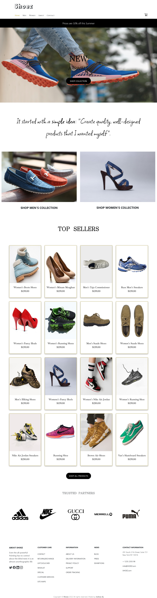

#   SHOEZ STORE WEBSITE


## Table of contents

- [Overview](#overview)
  - [Screenshot](#screenshot)
  - [Links](#links)

  - [Built with](#built-with)
  - [What I learned](#what-i-learned)
  - [Continued development](#continued-development)

- [Author](#author)


## Overview
This is a modification of a free shoe ecomerce website that I found online, I recreated majority of the original ui with basic css and javascript as a way of challenging my genral ui skills, it was built with html css javascript and a little bit of Bootstrap
### The challenge

Users should be able to:

- View the optimal layout for the site depending on their device's screen size
- See hover states for all interactive elements on the page

### Screenshot




### Links
- Live Site URL: [cick here to see the live site](https://JAjorgbor.github.io/shoez-store/)

## My process
I built the layout with html css and bootstrap with consideration for genral breakpoints to make the website responsive, I then used javascript dom manipulation to make the website more interactive particularly uin the navigation hamburger menue

### Built with

-  HTML5 markup
- CSS custom properties
- Flexbox
- CSS Grid
- Mobile-first workflow
- Vanilla Javascript 

### What I learned
I learnt how to use javascript even lsiteners to create effects for click events
```js
menue_bar.addEventListener("click", hamburgerTransition);


function hamburgerTransition(e) {

    if (!isPushed) {
        // menue_bar.style.backgroundColor = "black";
        menue_bar.style.animationName = "move_hamburger_left";
        menue_bar.style.position = "fixed";
        menue_bar.style.right = "50px";

        bar[0].style.animationName = "open0";
        bar[1].style.animationName = "open1";
        bar[2].style.animationName = "open2";
        document.querySelector(".nav_container").style.display = "flex";
        document.querySelector(".nav_container").style.animationName = "pop-out";

        document.querySelector(".color-back").style.display = "block";
        
        // menue_bar.addEventListener("click", myFunc2);
        isPushed = true;

    } else {
        // e.target.style.backgroundColor = "black";
        menue_bar.style.position = "relative";
        menue_bar.style.right = "0";

        e.target.style.animationName = "move_hamburger_back";
        bar[0].style.animationName = "closed0";
        bar[1].style.animationName = "closed1";
        bar[2].style.animationName = "closed2";
        // document.querySelector(".nav_container").style.display = "none";
        document.querySelector(".nav_container").style.animationName = "pop-in";
        document.querySelector(".color-back").style.display = "none";

        

        isPushed = false;
    }

}
```


### Continued development

I would like to learn how to better use event listeners to make my futrure websites more interactive in an efficient manner without needing to trigger animations with the @keyframes syntac in css
## Author
- Twitter - [@yourusername](https://www.twitter.com/jAjorgbor)
- LinkedIn - [my LinkedIn](https://www.linkedin.com/in/joshua-ajorgbor-b0bba6227/)
